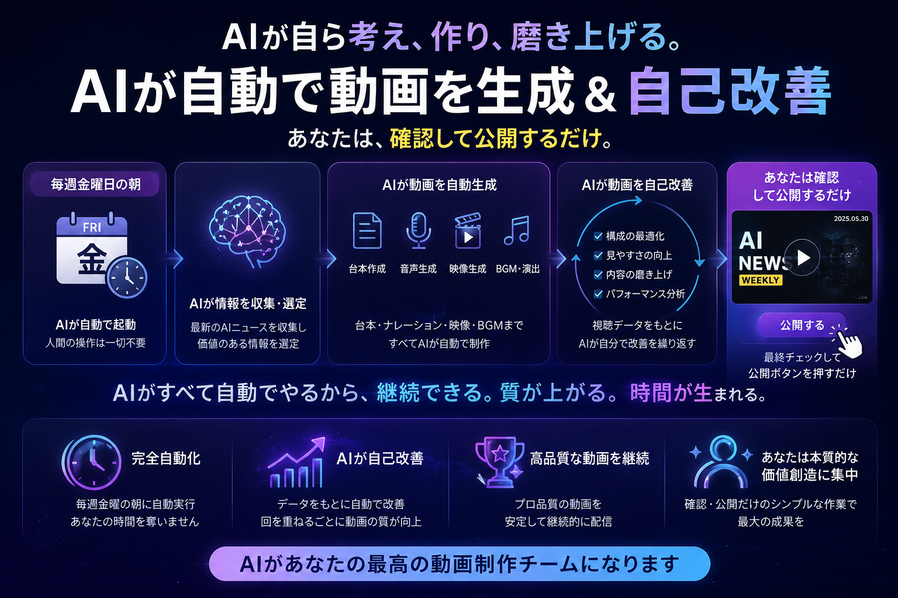
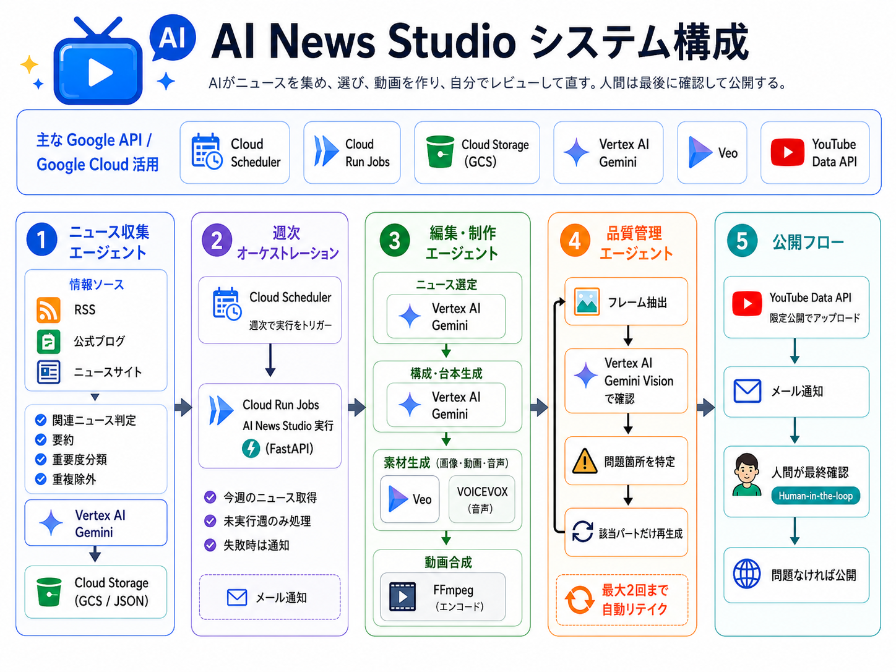

# AI News Studio




AIニュース動画制作管理ツール。直近1週間の優先度Aニュースを自動収集し、週次動画ドラフトをワンクリックで生成します。



## 構成

```
ai-news-studio/
  frontend/      # Vite + React + TypeScript フロントエンド
  backend/       # Python / FastAPI バックエンド
  Dockerfile     # Cloud Run 用 Multi-stage build
```

---

## ローカル開発

### バックエンド単体起動

```bash
# 1. 環境変数
cp backend/.env.example backend/.env
# backend/.env を編集（BASIC_AUTH_PASSWORD 等）

# 2. 依存インストール & 起動
cd backend
uv sync --python 3.11 --system-certs
uv run uvicorn app.main:app --reload --port 8000
```

`http://localhost:8000/api/health` → `{"status":"ok"}` が返れば OK（認証不要）。

### フロントエンド単体起動

```bash
# 1. 環境変数
cp frontend/.env.example frontend/.env.local
# frontend/.env.local の API_USERNAME / API_PASSWORD を backend/.env と合わせる

# 2. 依存インストール & 起動
cd frontend
npm install
npm run dev
```

`http://localhost:5173` でアクセス。Vite のプロキシが `/api/*` を FastAPI に転送し、Basic 認証ヘッダーをサーバー側で付与します（ブラウザに認証情報は露出しません）。

### 一体起動（フロント + バックエンド）

バックエンドを `:8000` で起動後、フロントエンドを `:5173` で起動するだけです（上記の順番で両方起動）。

---

## Docker（ローカル確認）

```bash
# ビルド
docker build -t ai-news-studio .

# 起動
docker run -p 8080:8080 \
  -e BASIC_AUTH_USERNAME=admin \
  -e BASIC_AUTH_PASSWORD=secret \
  ai-news-studio
```

`http://localhost:8080` にアクセス → ブラウザの Basic 認証ダイアログが表示されます。

---

## Cloud Run デプロイ

### 前提

- GCP プロジェクトに Artifact Registry リポジトリ `ai-news-studio` を作成済み
- Cloud Run API が有効
- Secret Manager に以下のシークレットを作成済み:
  - `basic-auth-username`
  - `basic-auth-password`

### GitHub Actions による自動デプロイ

`main` ブランチへの push で自動的にビルド・デプロイされます。

以下の GitHub Secrets を設定してください:

| Secret | 説明 | 値の例 |
|---|---|---|
| `GCP_PROJECT_ID` | GCP プロジェクト ID | `my-project-123` |
| `GCP_REGION` | リージョン | `asia-northeast1` |
| `GCP_WIF_PROVIDER` | Workload Identity Federation プロバイダー | `projects/123/locations/global/workloadIdentityPools/github/providers/github` |
| `GCP_SERVICE_ACCOUNT` | デプロイ用サービスアカウント | `deployer@my-project.iam.gserviceaccount.com` |

### Secret Manager で認証情報を渡す

Cloud Run にデプロイする際、`BASIC_AUTH_USERNAME` / `BASIC_AUTH_PASSWORD` は Secret Manager から自動的に環境変数として注入されます（`.github/workflows/deploy.yml` の `--set-secrets` 参照）。

---

## 週次動画の自動アップロードとメール通知

週次動画生成後に、生成済み動画を YouTube へ **限定公開(unlisted)** で自動アップロードし、限定公開URLと動画内容をメールで通知できます。

YouTube 認証情報の取得手順は [docs/youtube-oauth.md](docs/youtube-oauth.md) を参照してください。Google Cloud Console で YouTube Data API v3 を有効化し、OAuth クライアントID（Desktop app）を作成したあと、以下でリフレッシュトークンを取得します。

```bash
cd backend
uv run python scripts/get_youtube_refresh_token.py <CLIENT_ID> <CLIENT_SECRET>
```

`backend/.env` には以下を設定します。

```env
YOUTUBE_CLIENT_ID=xxxx
YOUTUBE_CLIENT_SECRET=yyyy
YOUTUBE_REFRESH_TOKEN=zzzz
YOUTUBE_UPLOAD_ENABLED=true

WEEKLY_VIDEO_SCHEDULE_ENABLED=true
WEEKLY_VIDEO_SCHEDULE_TIMEZONE=Asia/Tokyo
WEEKLY_VIDEO_SCHEDULE_HOUR=8
WEEKLY_VIDEO_SCHEDULE_MINUTE=0

WEEKLY_VIDEO_NOTIFY_TO=recipient@example.com
WEEKLY_VIDEO_NOTIFY_FROM=sender@example.com
SMTP_HOST=smtp.example.com
SMTP_PORT=587
SMTP_USERNAME=sender@example.com
SMTP_PASSWORD=xxxx
SMTP_USE_TLS=true
SMTP_USE_SSL=false
```

成功メールには、動画タイトル、生成ID、限定公開URL、YouTube説明文、チャプター、ハッシュタグ、採用ニュースごとの要約・影響・アクション・ソース、参照URLが含まれます。失敗時は例外内容をメール通知します。

> **注意:** 2020年7月28日以降に作成された未検証の YouTube API プロジェクトでは、アップロード動画が private に制限される場合があります。限定公開運用を継続する場合は、Google / YouTube 側の検証や監査要件を確認してください。

---

## API エンドポイント

| Method | Path | 認証 | 説明 |
|--------|------|------|------|
| GET | /api/health | 不要 | ヘルスチェック（Cloud Run 用） |
| GET | /api/news/weekly | Basic | 直近7日の全ニュース |
| GET | /api/news/priority-a | Basic | 優先度A・使用済み除外 |
| POST | /api/drafts/generate-weekly | Basic | 週次ドラフト生成 |
| GET | /api/drafts/latest | Basic | 最新ドラフト取得 |
| GET | /api/used-news | Basic | 使用済みニュース一覧 |
| POST | /api/used-news | Basic | 使用済みとして記録 |
| POST | /api/videos/generate-from-latest | Basic | 最新ドラフトから動画生成 |
| POST | /api/videos/generate-weekly-from-new-draft | Basic | 新規週次ドラフト生成から動画生成まで実行 |
| GET | /api/videos | Basic | 生成済み動画一覧 |
| GET | /api/videos/{video_id} | Basic | 生成済み動画メタデータ取得 |
| GET | /api/videos/{video_id}/download | Basic | 動画ファイル取得 |
| GET | /api/videos/{video_id}/thumbnail | Basic | サムネイル取得 |
| POST | /api/videos/{video_id}/upload-youtube | Basic | YouTube へ限定公開でアップロード |
| POST | /api/videos/{video_id}/publish | Basic | アップロード済み動画を公開に切り替え |

---

## データ永続化

使用済みニュースと最新ドラフトは `backend/data/` に JSON ファイルとして保存されます（`.gitignore` 対象）。

> **注意:** Cloud Run のコンテナは再起動でデータが消えます（ephemeral filesystem）。本番運用で永続化が必要な場合は Cloud Storage または Firestore への移行を検討してください。
